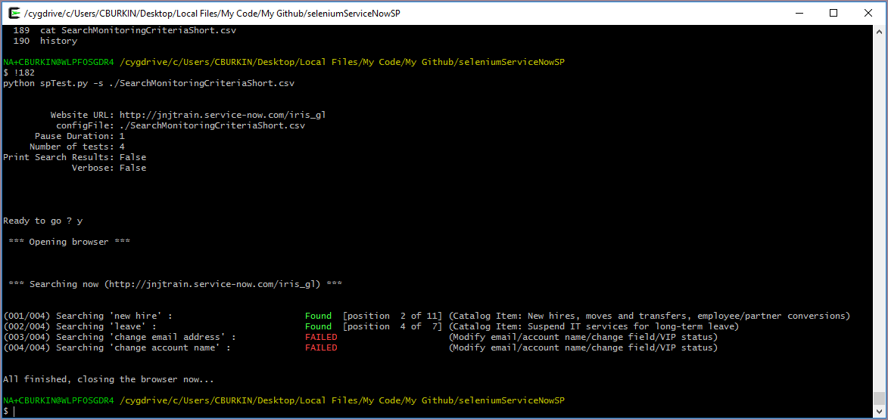

## Testing ServiceNow (Service Portal) with Selenium

Automated testing of searching a ServiceNow Service Portal.  Reads the results, verifies that the desired item is present.  Shows you how far down the list the result is.


### Environment

This was developed on a Windows 10 machine using chrome.  No testing was done on other platforms/browsers yet

### Installation (for usage on the much better CygWin terminal/shell)

- Install Cygwin (choosing python 2.7)
- In .bashrc, explictly set your path to remove all Windows paths (e.g. /usr/bin; /usr/local/bin; ~/bin)
- Set your PYTHONPATH to /usr/lib/2.7

So, your ~/.bashrc should have this at the bottom:

```
# Set path for calling command-line executables/scripts
export PATH=/usr/bin:/usr/local/bin:~/bin
# Search path for importing python modules
export PYTHONPATH=/usr/lib/python2.7
```


- In Cygwin, install pip via "easy_install-2.7 pip"
- In Cygwin, install selenium via "pip install selenium"


### Installation (for usage on the boring and awful Windows prompt)

NOTE: You won't get color output for pass/fail, and copying from the Windows prompt is a bit painful

- Install Windows Python

(finish these instructions later)


### Usage (calling the program)


Example of usage:

```

$ python spTest.py -h
usage: spTest.py [-h] [-v] [-r] [--message MESSAGE] [-p P] [-w W] [-s S]

Does search testing on Iris (ServiceNow) website

optional arguments:
  -h, --help         show this help message and exit
  -v                 verbose_mode
  -r                 print search results
  --message MESSAGE
  -p P               amount to pause selenium tester
  -w W               ServiceNow website to test against
  -s S               list of search terms to run (in CSV format with one
                     header row)
```

### Usage (format of the input file)

The format of the input file (CSV), and assumes that first line is column headers.  

- Column1: sys_id of the item you'd like to find
- Column2: Friendly name of the catalog item 
- Column3: text for the search field

Example of intput file

```
Sys ID,SID/OG,Search Term
3e94804b6f88ad041e02e3764b3ee4cf,"new hire, moves and transfers, employee/partner conversions",new hire
cb41e2e56f8329001e02e3764b3ee4c1,Suspend IT services for long-term leave,leave
c21f80036f4865c038ef17831c3ee4b1,Modify email/account name/change field/VIP status,change email address
c21f80036f4865c038ef17831c3ee4b1,Modify email/account name/change field/VIP status,change account name
```

### Screenshots



